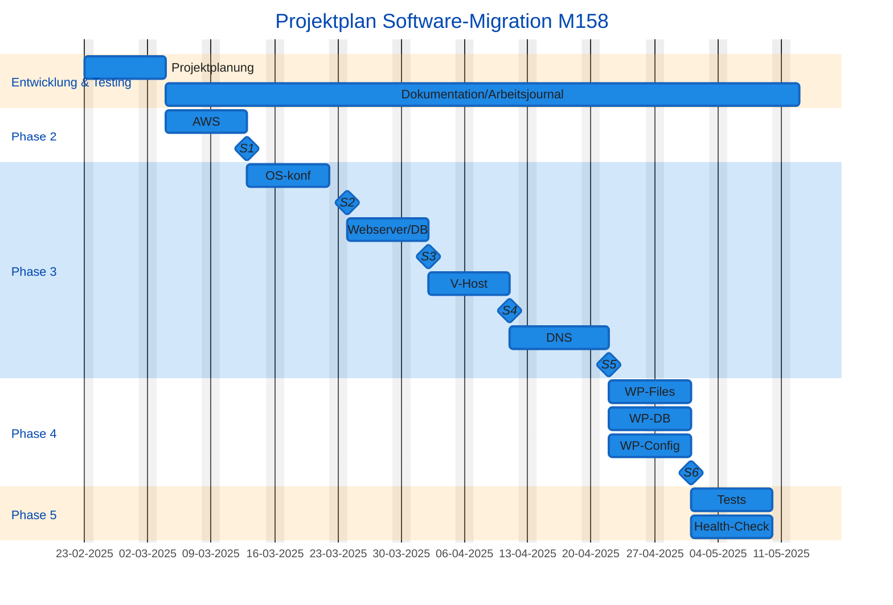
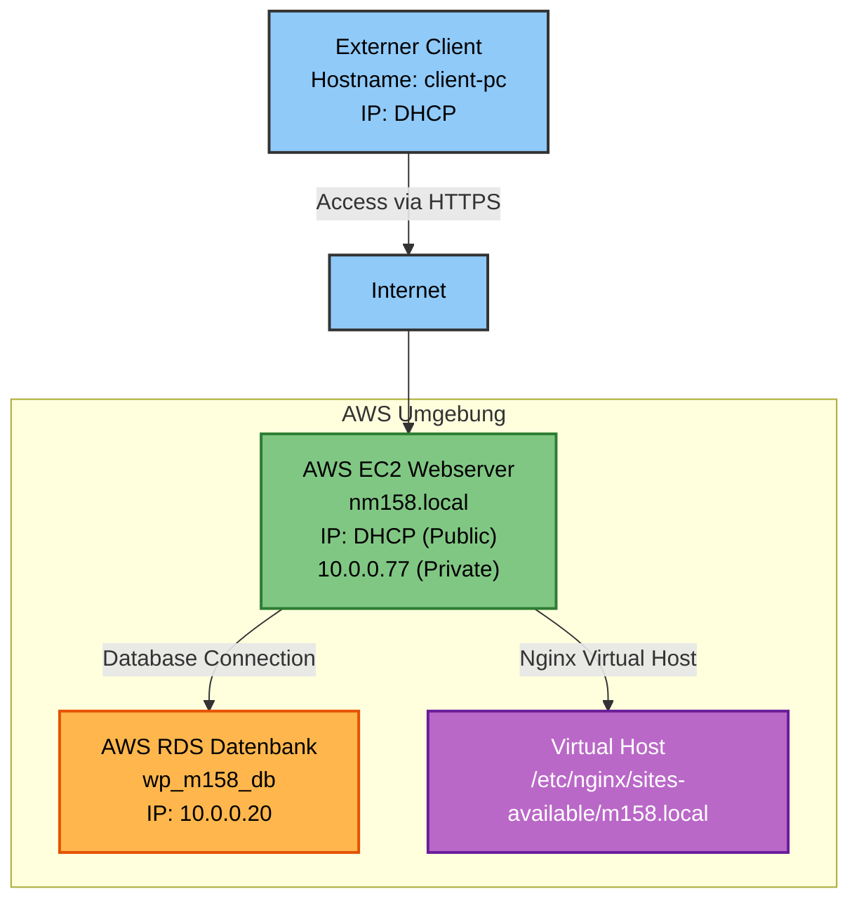

# Mo 158

## Phase 1

### Projektplan




### Architekturdiagramm



## Phase 2

#### instanz 1

ipconfig 


ping:


ping 8.8.8.8


#### instanz 2

ipconfig 


ping:


ping 8.8.8.8


## Phase 3

### DNS


# Webserver bis FTP-Einrichtung (Aufgaben 5–9)

---

## Aufgabe 5: Webserver (Apache + HTTPS + Rewrite)

### Ziel:
Sicherer Webserver mit HTTPS, Redirect von HTTP, RewriteEngine und Virtual Hosts.

### Schritte:
```bash
sudo apt update
sudo apt install apache2 -y
sudo a2enmod rewrite ssl
sudo openssl req -x509 -nodes -days 365 -newkey rsa:2048 \
  -keyout /etc/ssl/private/apache-selfsigned.key \
  -out /etc/ssl/certs/apache-selfsigned.crt
```

### Konfiguration:
- `/etc/apache2/sites-available/000-default.conf`: HTTP → HTTPS Redirect
- `/etc/apache2/sites-available/edris-ssl.conf`: HTTPS + SSL-Zertifikat

### Screenshots:


---

## Aufgabe 6: PHP + PHP-FPM

### Ziel:
Aktuelle PHP-Version mit `php.ini`-Anpassung und PHP-FPM Integration.

### Schritte:
```bash
sudo apt install php8.3 php8.3-fpm -y
sudo nano /etc/php/8.3/apache2/php.ini
# Werte anpassen:
# upload_max_filesize = 64M, post_max_size = 64M, memory_limit = 256M
```

### Screenshots:


---

## Aufgabe 7: Dedizierter MariaDB-Server

### Ziel:
Eigener DB-Server mit Benutzer `wpuser`, eingeschränkten Rechten und Root nur lokal.

### Schritte:
```bash
sudo apt install mariadb-server -y
sudo nano /etc/mysql/mariadb.conf.d/50-server.cnf
# bind-address = 0.0.0.0

# In MySQL:
CREATE DATABASE wordpress;
CREATE USER 'wpuser'@'%' IDENTIFIED BY 'passwort';
GRANT SELECT, INSERT, UPDATE, DELETE ON wordpress.* TO 'wpuser'@'%';
DELETE FROM mysql.user WHERE User='root' AND Host!='localhost';
```

### Screenshots:


---

## Aufgabe 8: PhpMyAdmin via Docker + Subdomain

### Ziel:
PhpMyAdmin über `phpmyadmin.edris.info` per Docker + Apache Reverse Proxy.

### Schritte:
**docker-compose.yml**
```yaml
services:
  phpmyadmin:
    image: phpmyadmin/phpmyadmin
    environment:
      PMA_HOST: <DB-IP>
      PMA_PORT: 3306
    ports:
      - "8081:80"
```

**Apache-VHost:**
```apache
<VirtualHost *:80>
    ServerName phpmyadmin.edris.info
    ProxyPass / http://localhost:8081/
    ProxyPassReverse / http://localhost:8081/
</VirtualHost>
```

**SSL aktivieren:**
```bash
sudo certbot --apache -d phpmyadmin.edris.info
```

### Screenshots:


---

## Aufgabe 9: FTP-Server (vsftpd + FTPS)

### Ziel:
Sicherer FTP-Zugang mit TLS-Verschlüsselung und eingeschränktem Zugriff.

### Schritte:
```bash
sudo apt install vsftpd -y
sudo openssl req -x509 -nodes -days 365 -newkey rsa:2048 \
  -keyout /etc/ssl/private/vsftpd.key \
  -out /etc/ssl/certs/vsftpd.crt

sudo adduser ftpuser
sudo usermod -d /var/www/html ftpuser
sudo chmod a-w /var/www/html
sudo mkdir /var/www/html/ftp
sudo chown ftpuser:ftpuser /var/www/html/ftp
```

**Wichtige vsftpd.conf Optionen:**
```ini
chroot_local_user=YES
allow_writeable_chroot=YES
ssl_enable=YES
force_local_data_ssl=YES
force_local_logins_ssl=YES
```

### Screenshots:
- 
- 
- 


## Fazit

- Alle Systeme sind modular, sicher und dokumentiert
- SSL und Benutzerberechtigungen korrekt gesetzt
- Screenshots belegen erfolgreiche Umsetzung aller Aufgaben

